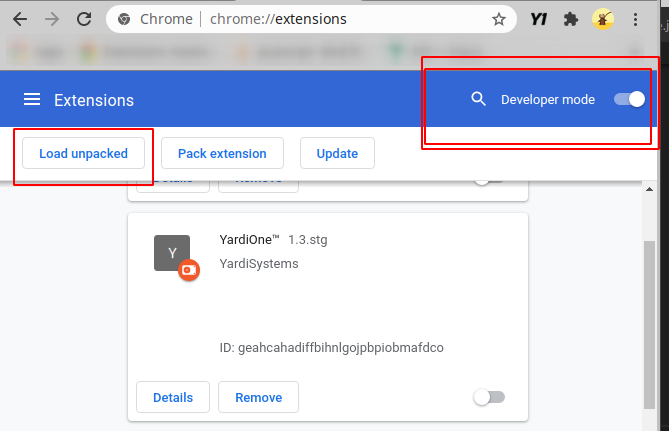
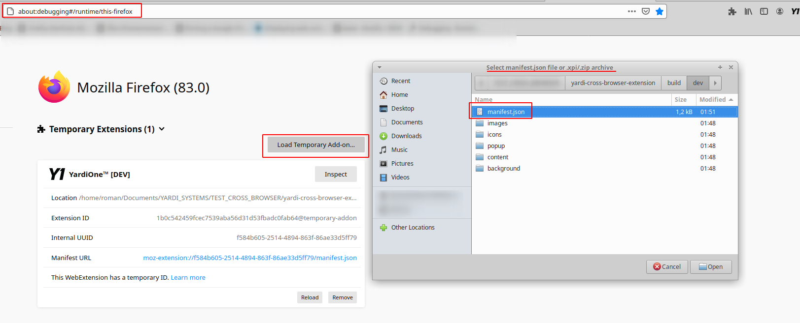
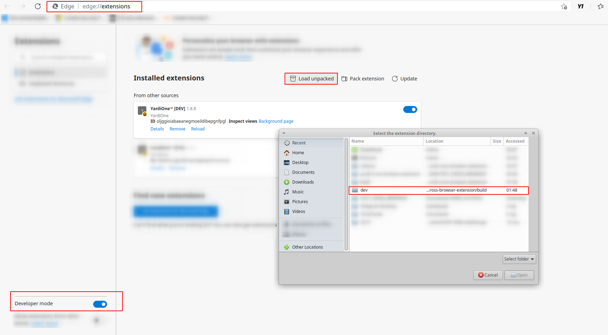
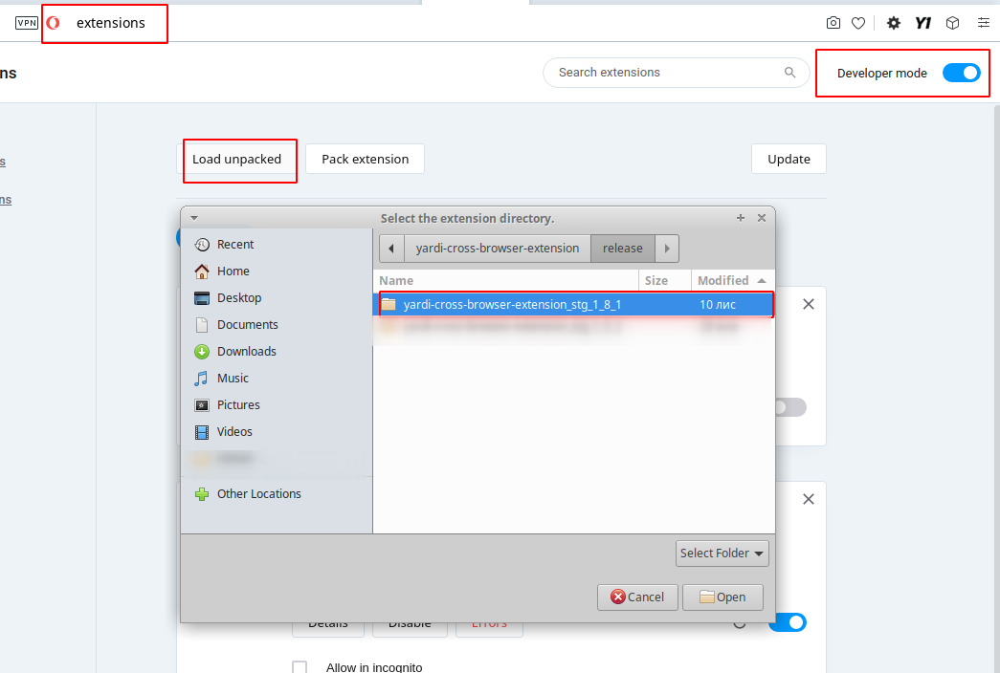

## RUN PROJECT

#### *NPM*

- from project root folder
- run command `npm run watch`

Due to some *folder permission denied* happens under Linux -
use command `sudo chown -R $(whoami) ./build` under root folder to get access

CREATE ZIP FOLDER

- Development `npm run zip:dev`
- Staging`npm run zip:stg`
- Prod `npm run zip:prod` or `npm run release`

### Dev mode

- find **`build/dev`** folder (will be created automatically under project root) to test builds under development mode

## TEST EXTENSION

### Google Chrome

1. go to [chrome://extensions/](chrome://extensions/)
2. turn on `Developer mode` on top right
3. click to `Load unpacked`
4. choose folder with uppacked extension

### Mozilla Firefox

1. go to [about:addons](about:addons)
2. click to setting icon on top tight
3. choose `Debug Add-ons` or enter this link [about:debugging#/runtime/this-firefox](about:debugging#/runtime/this-firefox)
4. click to `Load Temporary Add-on..`
5. choose `manifest.json` from uppacked extension folder

### Microsoft Edge

1. go to [edge://extensions/](edge://extensions/)
2. turn on `Developer mode` on left bottom side
3. click to `Load unpacked`
4. choose folder with uppacked extension

### Opera

1. go to [opera://extensions](opera://extensions)
2. turn on `Developer mode` on top right
3. click to `Load unpacked`
4. choose folder with uppacked extension

